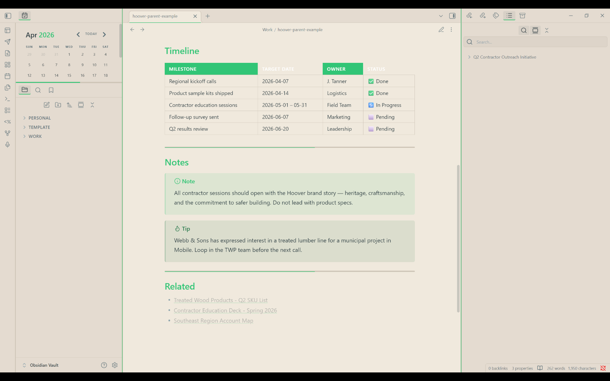
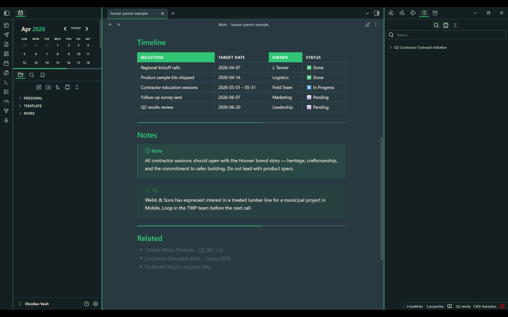
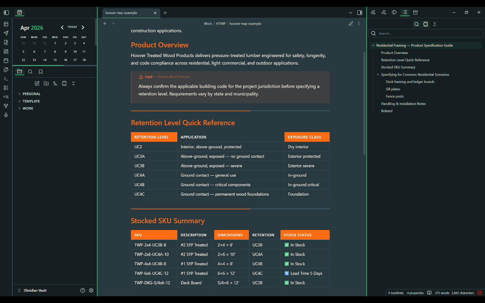
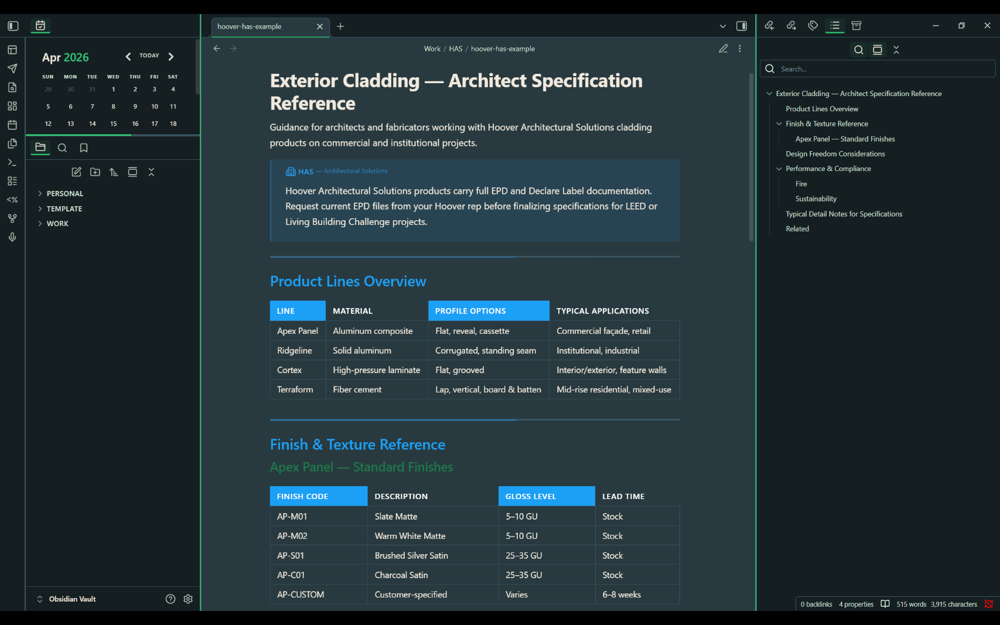

# Hoover Obsidian Theme

An [Obsidian](https://obsidian.md) theme built to the **Hoover Brand Guidelines V2.0**, for use by Hoover employees and teams working across the parent brand and its divisions.

Supports both **light** and **dark** modes, and includes built-in styling for switching between the three brand identities:

| Division | Accent Color |
|---|---|
| **Hoover** (parent) | Hoover Green `#31C576` |
| **Hoover Treated Wood Products** | Hoover Orange `#FF6C13` |
| **Hoover Architectural Solutions** | Hoover Blue `#1BA0F5` |

---

## Screenshots

### Light Mode


### Dark Mode


### Treated Wood Products Division


### Architectural Solutions Division


---

## Installation

### Option A — Manual (recommended for internal use)

1. In your Obsidian vault, open the folder `.obsidian/themes/` (create it if it doesn't exist)
2. Inside `themes/`, create a new folder called `Hoover`
3. Copy `theme.css` and `manifest.json` into that folder
4. In Obsidian, go to **Settings → Appearance → Themes**
5. Select **Hoover** from the dropdown
6. Done ✓

Your theme folder should look like this:

```
YourVault/
└── .obsidian/
    └── themes/
        └── Hoover/
            ├── theme.css
            └── manifest.json
```

> **Note:** `.obsidian` is a hidden folder. On Windows, enable "Show hidden items" in File Explorer. On Mac, press `Cmd + Shift + .` to reveal hidden folders.

---

## Division Switching

The theme supports three Hoover brand identities. You can switch at the note level or vault-wide.

### Per-note (frontmatter)

Add a `cssclasses` property to any note's frontmatter to apply a division color scheme to that note:

```yaml
---
cssclasses:
  - hoover-twp
---
```

| Class | Division |
|---|---|
| *(none)* | Hoover parent brand |
| `hoover-twp` | Hoover Treated Wood Products |
| `hoover-has` | Hoover Architectural Solutions |

**What changes:** The note gets a division-colored left border, H2 headings switch to the division accent color, and tags pick up the division tint.

### Per-section callout

Use a callout inside any note to mark a content block as belonging to a specific division:

```markdown
> [!twp]
> This section covers Treated Wood Products specifications.

> [!has]
> This section relates to an Architectural Solutions project.
```

These callouts automatically label themselves "Treated Wood Products" or "Architectural Solutions."

### Vault-wide (Style Settings plugin)

If your team uses the [Style Settings](https://github.com/mgmeyers/obsidian-style-settings) plugin, a **Division selector** dropdown is available under **Settings → Style Settings → Hoover Brand Theme** that switches the entire vault's accent color at once.

---

## Color Reference

| Name | Hex | Usage |
|---|---|---|
| Hoover Green | `#31C576` | Primary accent, links, active elements |
| Hoover Slate | `#283A40` | Primary text (light mode), dark backgrounds |
| Hoover Cream | `#F0E9DD` | Light mode background, dark mode text |
| Hoover Dark Green | `#1E7848` | H3 headings, hover states |
| Hoover Black | `#151F22` | Darkest background layer |
| Hoover Mint | `#C8DFCF` | Muted text (dark mode) |
| Hoover Orange | `#FF6C13` | Treated Wood Products accent |
| Hoover Blue | `#1BA0F5` | Architectural Solutions accent |

---

## Typography

The theme is designed for use with the Hoover brand typefaces. These must be installed on your system separately.

| Role | Font |
|---|---|
| Headlines (H1–H6) | **N27 Medium** |
| Body copy | **Acumin Pro** (Light / Regular) |
| Labels / bold copy | **Acumin Pro** (Semibold / Bold) |
| Code | JetBrains Mono / Fira Code / system monospace |

If N27 or Acumin Pro are not installed, the theme falls back cleanly to the system sans-serif font.

---

## Recommended Plugins

These plugins enhance the theme experience but are not required:

- **[Style Settings](https://github.com/mgmeyers/obsidian-style-settings)** — enables the division selector dropdown and color customization panel

---

## Versioning

This theme follows [Semantic Versioning](https://semver.org/):

- `MAJOR.x.x` — Breaking change or full redesign
- `x.MINOR.x` — New feature or division added
- `x.x.PATCH` — Bug fix or small visual tweak

See [CHANGELOG.md](CHANGELOG.md) for full history.

---

## Contributing

This theme is maintained internally. To contribute:

1. Fork the repository (if you have GitHub access)
2. Make your changes in `theme.css`
3. Update `CHANGELOG.md` with a description of what changed
4. Bump the version number in `manifest.json`
5. Open a Pull Request and assign it to the theme maintainer

For questions, contact the person who shared this repository with you.

---

## License

Internal use only. This theme incorporates Hoover brand colors and typography per the Hoover Brand Guidelines V2.0. Do not distribute outside the organization.
